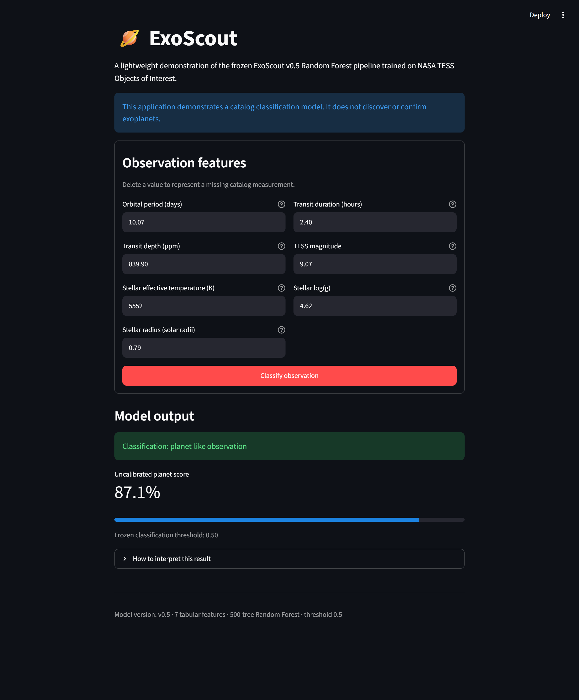
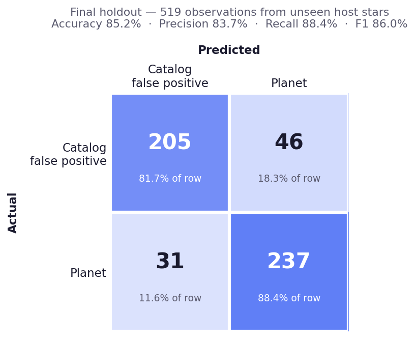
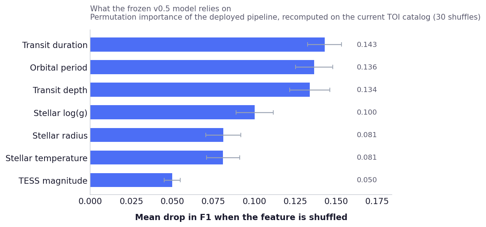
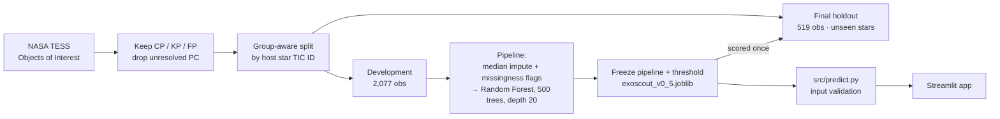

# 🪐 ExoScout

**Tells real exoplanets apart from catalog false positives in NASA TESS data.**
A Random Forest trained on 7 catalog measurements — **86.0% F1 on a held-out set of stars the model had never seen**, wrapped in an interactive Streamlit demo.


<p align="center">
  
</p>

## At a glance

- **Problem** — the NASA TESS Objects of Interest catalog is full of false positives (eclipsing binaries, noise, blends) that have to be vetted by hand.
- **Approach** — a Random Forest on 7 tabular catalog features, with the train/test boundary drawn **between host stars** so no star leaks across it.
- **Discipline** — feature set, pipeline, hyperparameters, metric and threshold were **frozen before** a 519-observation holdout was opened, and the holdout was scored **once**.
- **Result** — 86.0% F1 on that holdout, in line with the group-aware development estimate.

> ExoScout demonstrates a catalog *classifier*. It does not discover or confirm exoplanets, and its scores are **not** calibrated probabilities.

## Results

| Evaluation set  | Accuracy | Precision | Recall | F1-score |
| --------------- | -------: | --------: | -----: | -------: |
| Development OOF  |    83.2% |     81.1% |  88.1% |    84.5% |
| Final holdout    |    85.2% |     83.7% |  88.4% |    86.0% |

<p align="center">
  
  
</p>

The model leans on the **transit geometry** — duration, orbital period and depth —
far more than on stellar properties, matching the out-of-fold analysis in v0.4.

## Try it in 30 seconds

Python 3.13 recommended.

```bash
git clone https://github.com/stoppo22/exoscout.git
cd exoscout

python -m venv .venv
source .venv/bin/activate          # Windows: .venv\Scripts\Activate.ps1

python -m pip install -r requirements.txt
streamlit run app.py
```

The app takes the seven catalog measurements and returns a planet-like /
false-positive-like call, the uncalibrated Random Forest score, and the frozen
threshold. Empty fields are treated as missing measurements and handled by the
pipeline's median imputation and missingness indicators.

## How it works



* **Notebooks** (`notebooks/`) — the research trail, v0.1 → v0.5, one notebook per stage.
* **`src/predict.py`** — loads the frozen artifact, validates input (numeric, finite, positivity constraints per feature), builds the observation, returns the prediction.
* **`app.py`** — the Streamlit interface.

## Project structure

```text
exoscout/
├── artifacts/exoscout_v0_5.joblib     # frozen pipeline + metadata
├── docs/METHODOLOGY.md                # full protocol, limitations, version history
├── notebooks/                         # 01_baseline … 05_model_optimization_and_final_evaluation
├── src/
│   ├── load_data.py                   # downloads / caches the TOI table
│   └── predict.py                     # validated inference
├── app.py
├── requirements.txt
└── README.md
```

## Learn more

**[docs/METHODOLOGY.md](docs/METHODOLOGY.md)** covers the evaluation protocol,
hyperparameter search, interpretability and error analysis, the full limitations
list, and the version history.

## License

MIT — see [LICENSE](LICENSE).
